# GREEN FIELDS

## Fully functioning static HTML/CSS/Bootstrap website.

Keywords: github, pages, static website, coursework.

Green Fields is a website designed to showcase the fictional band Green Fields. By giving users the ability to learn about their members, history and get in contact with them regarding utilising them for personal and commercial reasons.

- The landing page allows the user to instantly get a feel for the style/tone of the band and providing immediate call outs for signing up for email or getting in touch with the band.
- The second 'Meet the Team' section gives a more detailed background of the band and has a video featuring a member of the band playing in front of a church.
- The last section includes a form allowing the user to get in touch with the band.

The overal visual design is clean and slightly rustic to keep in touch with the style of the fictional band and will inspire users to use Green Fields for their wedding or see them live.

To view the deployed website click [here](https://kierancg.github.io/Milestone1FolkRock/).

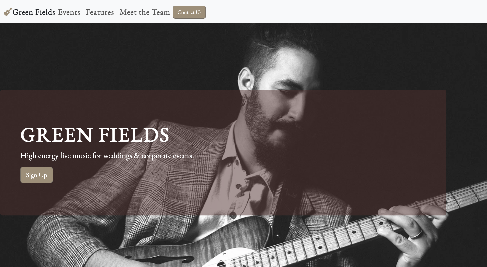

# UXD

## Website Intentions

For the User:

- Learn about Green Fields background and specifics.
- Find out when the band are playing and at what venues near them.
- Get in contact regarding booking them for their own wedding.

For the site developer:

- To provide clear and concise information to the user regarding how to get in contact.
- To make it easy for them to navigate the site and provide consistent navigational signage.
- To have a bold and memorable style that makes the user want to pick our band over others.

## Creation Process using the Agile Software Development Method

### 1. Requirements

It is a B2C website for people looking for a folk rock band either to listen or hire for weddings, the site needs to provide quality information and motivate users to take the next step and subscribe or contact the band.

### 2. Scope

It will have a minimalist design, with basic features such as a navigation bar and images. It will include a video which needs to be concise. The colour scheme will be in keeping with a folk theme, the whole design needs to be consistant so this means any media will need to be in alignment.

### 3. Architexture & Design

A landing page with a large image that immediatlely calls out the bands identity. All pages will be associated together with a navbar and footer element.

Three sections:

- Features: Short Bio with a link to the main "Meet the Team" link. Main section includes in keeping images with simple text blocks calling out the important information like history and functions of the band.
- Meet the Team: Cleanly laid out page with band member bios and images, also featuring an autoplay video with controls.

* Contact Form: User friendly contact form with another image to keep the engagement going with the user.

### 4. Construction

Using Balsamiq I created the wireframe for my site:

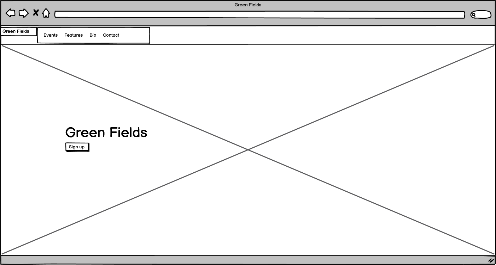

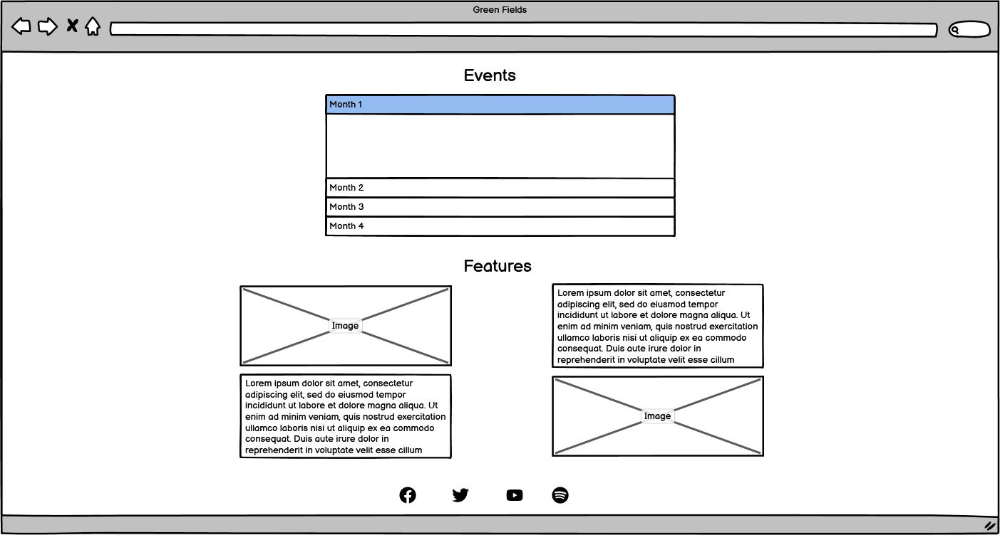

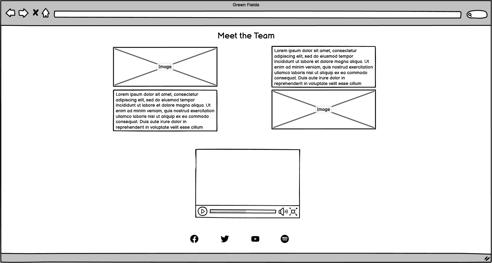

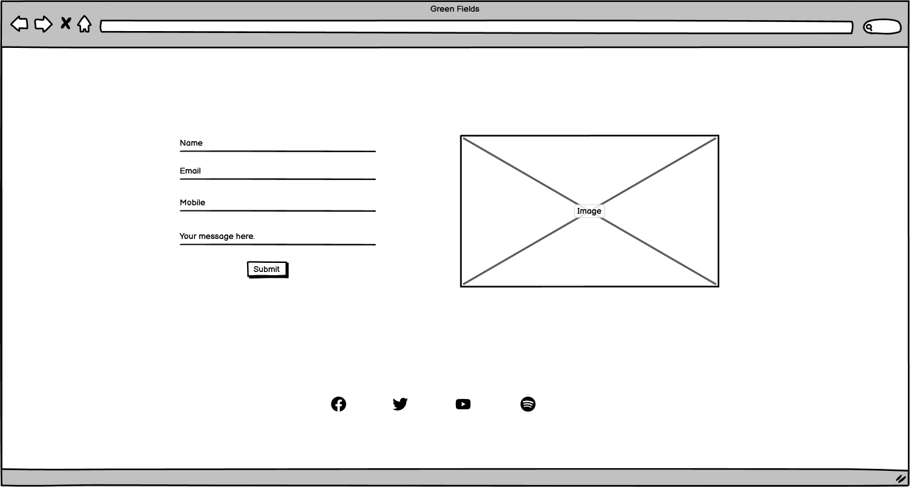

### 5. Development

I will use google fonts and choose one font that evokes a folk feeling, so that the title is capitvating and the text is easy to read. For the colour scheme researched a few other folk bands, picked a few colours and used [Colourmind](http://colormind.io/) to generate a palette. Being red/green colourblind it was very useful to offer me colours that work well together.

### Color Reference

| Color            | Hex                                                              |
| ---------------- | ---------------------------------------------------------------- |
| Lightest Color   |  #E8E581 |
| Highlight Color  |  #D7B796 |
| Background Color |  #AO8E76 |
| Contrast Color   |  #56302D |
| Darkest Color    |  #20150E |

## Development:

### Header and Nav

The Navbar is clean and simple. It features a font awesome icon to tie in with the Green Fields name, Both responsive and both take you either to the top of the page if on the main or back to the landing page. The Contact page link is a button, this is to make it plain and easy to understand for the user. If viewing on smaller screen the links, with the exception of 'Green Fields' and the font awesome icon, collapses to a drop down button. This was chosen to keep the user experience easy on a mobile device.

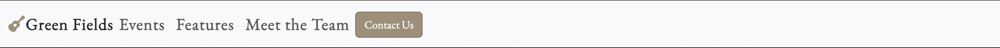

### Main image

I kept the main image greyscale and continued this style throughout the website, changing images to match, to stop overwhelm add a sense of style also it keeps the interactive buttons highlighted. It has a callout overlay with a modal 'Sign Up' button.

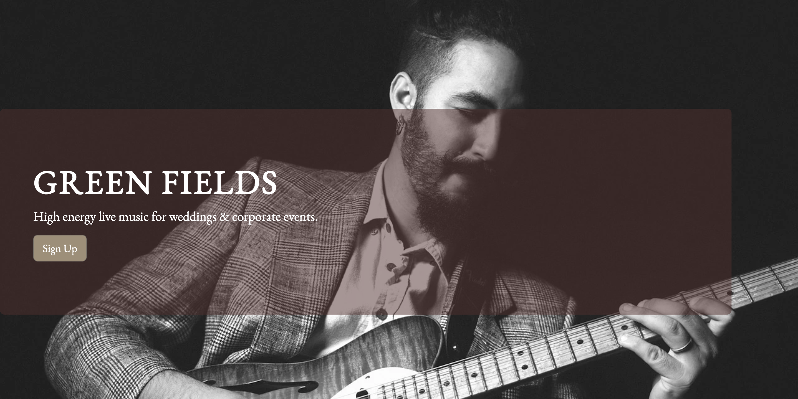

After clicking the 'Sign up' button the user is taken to a modal overlay to prompt joining the newsletter.

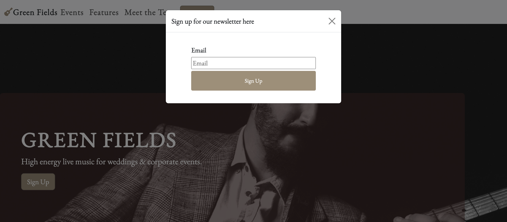

### Upcoming Events and Features section

The Upcoming events section uses an Accordion element. This was chosen as it allows the information to be viewed easily if the user is interested in it but keeps the majority hidden and the experience as simple as possible if not.

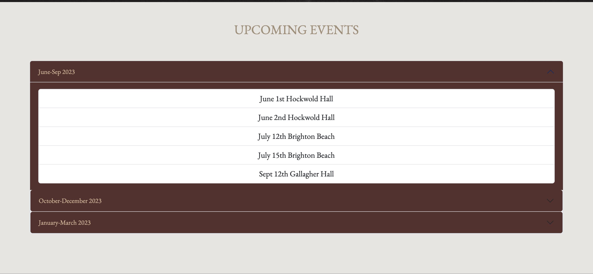

The features section has an adjacent image with a body of text, this breaks up any perception of a text heavy experience and keep the user thinking of how they would feel viewing the band themselves. On smaller screens and devices the design responds by moving the text and images one under the other. Each text box has a "Contact Us" button to take them straight to the Contact page if they've been swayed by the website so far.

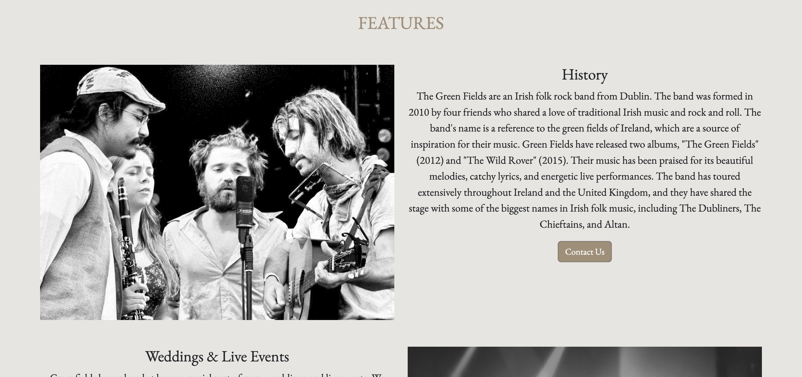

### Meet the Team

Meet the Team uses the same responsive column and row layout as the rest of the website to keep the experience homogenous. At the bottom is a video that fills the width of the screen, it has the autoplay function but is muted to prevent poor user experience and has controls.

It also contains a large video element, this breaks from the rest of the website as it retains it's colour. The idea was to keep the user engaged after they've made it this far and to give them an idea about how the band might look at their wedding.

### Contact page

The contact page retains the same responsive box layout but instead of a text box has a simply styled form element with required input and an input element for whatever enquiry the user may wish to ask the band.

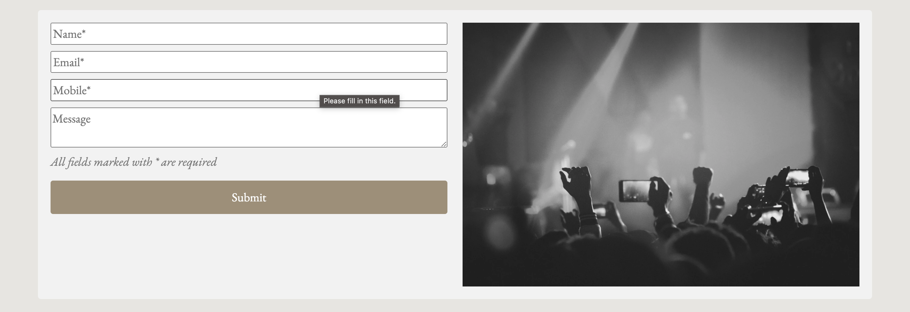

### Footer

The footer is laid out in a simple, pleasing and responsive column row format. The social media links also respond to being interacted with and navigate to the associated website in a new browser page to prevent poor UEX. I chose to use font awesome icons to represent them as these are the standard across the industry by keeping the links easy to understand and react to.

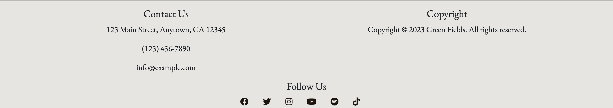

## Future features

As the site usage increases and the fictional band adds some strings to its bow I would add a spotify element with a highlight track. Also a merch page and finally I'd fill out the contact page with specific roles the band could in theory be called upon to function in.

## Testing

### HTML Validator

The website passed the W3 HTML validator after picking up 1 unclosed /div element.

### CSS Validator

Happily the CSS validator passed first time.
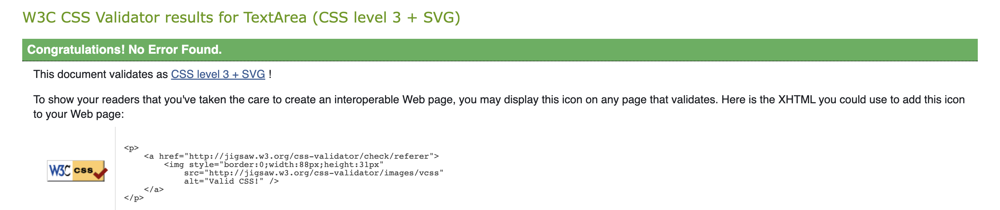

### Lighthouse

Lighthouse suggested changing the images from png files to WebP files to aid loading times and compression for speed/functionality which I implemented.

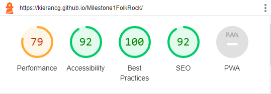

### Manual Testing

| Feature | Action | Expected result | Tested | Passed | Comments |
|:---:|:---:|:---:|:---:|:---:|:---:|
| Navbar | | | | | |
| BB | Click on the Home link | The user is redirected to the home page | Yes | Yes | - |
| Home | Click on the Home link | The user is redirected to the home page | Yes | Yes | - |
| Events | Click on the Events link | The user is redirected to the events section | Yes | Yes | - |
| Features | Click on the features link | The user is redirected to the features section | Yes | Yes | - |
| Meet the team | Click on the Meet the team link | The user is redirected to the Meet the team section | Yes | Yes | - |
| Contact us | Click on the Contact us link | The user is redirected to the Contact us section | Yes | Yes | - |
| Footer | | | | | |
| Instagram icon in the footer | Click on the Instagram link | The user is redirected to the Instagram webpage | Yes | Yes | - |
| Facebook icon in the footer | Click on the Facebook link | The user is redirected to the Facebook webpage | Yes | Yes | - |
| Spotify icon in the footer | Click on the Spotify link | The user is redirected to the Spotify webpage | Yes | Yes | - |
| Twitter icon in the footer | Click on the Twitter link | The user is redirected to the Twitter webpage | Yes | Yes | - |
| Youtube icon in the footer | Click on the Youtube link | The user is redirected to the Youtube webpage | Yes | Yes | - |
| Tiktok icon in the footer | Click on the Tiktok link | The user is redirected to the Tiktok webpage | Yes | Yes | User was taken away from the website, missing 'blank' tag. Bug fixed. |
| Contact Page | | | | | |
| Name Input | Enter Name | Name is entered | Yes | Yes | If user doesn't enter name, the error message appears |
| Email Input | Enter the email | The email is entered | Yes | Yes | If user doesn't enter the email, the error message appears. If user enters not valid email, the error message appears |
| Message input | Enter message | Message is entered | Yes | Yes | If user doesn't enter message, the error message appears. |
| "Submit" button | Click on the "Submit" button | The user is redirected to the response page | Yes | Yes | - |
| Response page | The user will be automatically redirected to the home page after 10 seconds | The user is redirected to the home page | Yes | Yes | - |

I have built and tested this site on Google Chrome, I've viewed it on Safari and Microsoft Edge and it works perfectly.

I have also tested it on an Iphone 11 Pro Max, for other mobiles I used the Google DevTools to view what it would look like.

### Issues and Solutions

Another issue was when creating my Favicon from the Favicon Generator as I had downloaded the zip file which contained a 'web manifest' file, when coded into my site this created a 404 error with Google. Once removing this entirely from my website the problem was solved.

My biggest issue was getting the navbar button to stick to the right hand side without pulling the rest of the links. After using flexbox and grid to no avail it turned out to be a simple margin auto fix.

## Deployment

The site was created on Codeanywhere then deployed to GitHub pages. To deploy the site:

1. In the GitHub repository, click to Settings.
2. On the left navagation bar click Pages.
3. Change the drop down on Branch to 'main' then click save.
4. Once it has been deployed a link will show at the top with the link to the site.

Click [here](https://github.com/KieranCG/Milestone1FolkRock) to view my Github repository.

## Credits

### Images

Images were taken from [Unsplash](https://unsplash.com/).

Icons were taken from [Font Awesome](https://fontawesome.com/).

Favicon created and generated using [Favicon](https://favicon.io/).

The video was taken from [Mixkit](https://mixkit.co/).

### Code

I adapted the code for the callout, modal and navbar section from [Bootstrap](https://getbootstrap.com/).

Fonts were chosen on [GoogleFonts](https://fonts.google.com/)

Colours were researched and chosen from [Colourmind](http://colormind.io/bootstrap/)

## Acknowledgements

- [Awesome Readme Templates](https://awesomeopensource.com/project/elangosundar/awesome-README-templates)
- [Awesome README](https://github.com/matiassingers/awesome-readme)
- [How to write a Good readme](https://bulldogjob.com/news/449-how-to-write-a-good-readme-for-your-github-project)
- [W3Schools](https://www.w3schools.com/)
- [Bootstrap](https://getbootstrap.com/)
- [readme.so](https://readme.so/editor)
- [mixkit.co](https://mixkit.co)

Final testing is displayed in a seperate word document in the 'docs' folder (folkrockfinaltesting.docx)